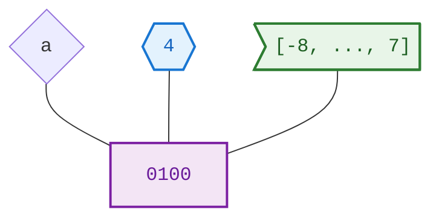
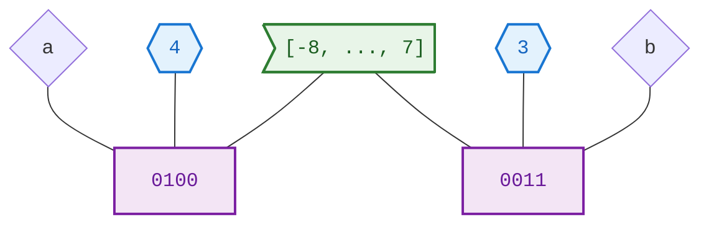
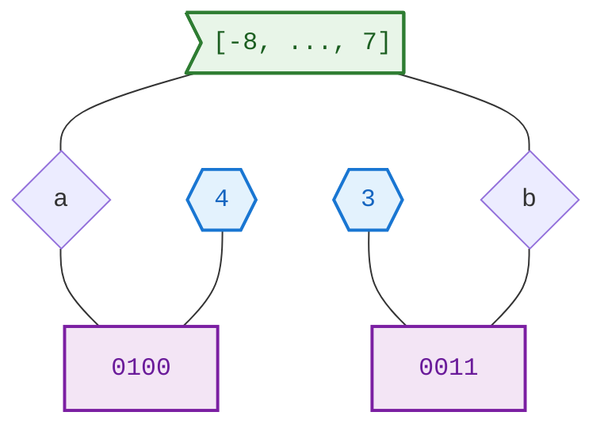
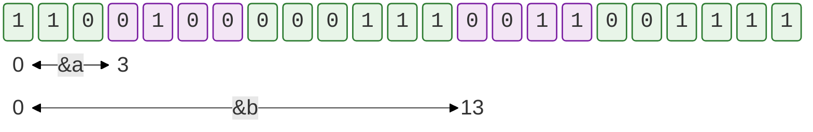
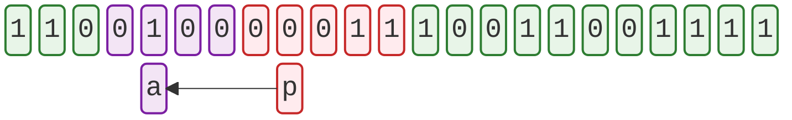
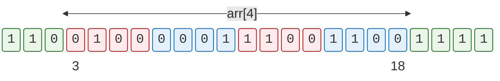
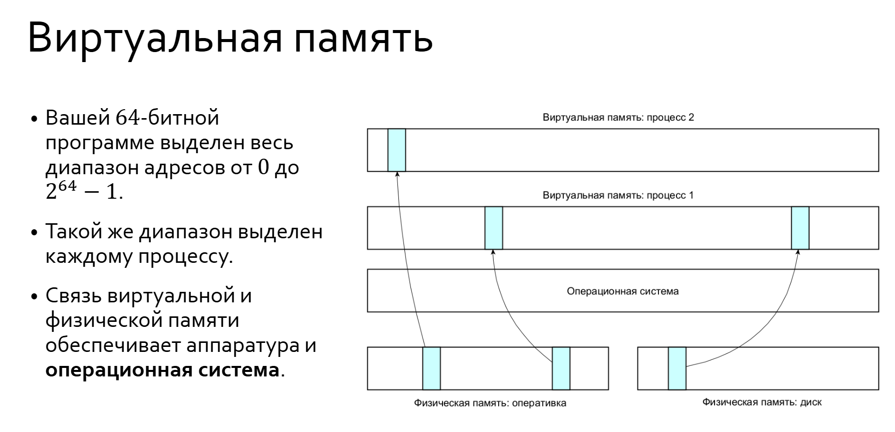

# Genesis

Разработаем некоторую машину для работы с данными.

Предположим, что у нас есть набор из четырёх бит: `0100`. Чтобы трактовать эти биты нам нужно договориться как и что они кодируют. Положим, что данные биты кодируют целые числа в диапазоне от -8 до 7: `[-8, ..., 7]`, а данный набор кодирует число 4 (согласно двоичной системе счисления). Теперь у данных битов есть три компоненты:
- *имя* : мы дали им имя `a`;
- *семантическое значение* - это то, что там сохранено (число 4). При этом семантическое значение не зависит от кодировки, машины, системы и тд, числу 4 (как самостоятельному объекту) могут соответствовать разные сущности, но это не влияет на присвоение значения.
- *тип*: пока это `value_type` (коробочка `[-8, ..., 7]`).

Заметим, что с помощью четырех бит мы можем закодировать 16 разных объектов (`2^4`), и это не обязательно должны быть числа от -8 до 7. Задавая тип (в данном случае целочисленный) необходимо определить операции (в данном случае математические) над этим типом. Пусть мы договорились о некоторых математических операциях по модулю 8 (`mod 8` - чтобы оставаться в заданных рамках) и дали название этому типу - например, `i4` (от слова `integer` и количества бит). 

Теперь у нас `object_type`, то есть тип объекта с именем `a` и семантическим (смысловым) значением 4.


Пусть мы добавили еще один объект с тем же типом, но с другими именем и значением, например `i4 b = 3`.


Если бы мы рассматривали язык с динамической типизацией (например, **Python**), то на этом рассмотрение бы закончилось. Действительно, по схемам выше мы видим, что ячейки с битами связаны с типом, и  разные моменты времени могут привязываться к разным типам.

Однако, язык **C** - это язык программирования со статической типизацией. Это означает, что тип связан не со значением, а с именем. То есть имя `a` (и `b`) навсегда принимает тип `i4`. Тип ячейки `0100` мы всегда понимаем на через имя, которое статически связано с типом.


# Пространственные соотношения

В языке С объекты не существуют в пустоте виртуальной машины (как в языке **Java**), они существуют в памяти (некотором адресном пространстве). Рассмотрим линейную модель памяти:



**Объект** (`i4 a = 4`) - это некоторые 4 бита в памяти, которые ничем не отличаются от битов, стоящих рядом. То, что мы их выделили в отдельный объект - просто наша договоренность. 

*Заметим, что в данном примере адресовать (обозначить местоположение в памяти) можно каждый бит (число 0 или 1), что отличается от поведения реальных процессоров, там адресовать можно каждый байт*.

Раз мы говорим, что данные ячейки адресуемы, то есть находятся в адресном пространстве, то в этом пространстве между ними существуют *пространственные отношения*. Мы можем, например сказать, что переменная с именем `a` находится ближе к началу адресного пространства, чем переменная с именем `b`. Расстояние от начала адресного пространства (памяти) до переменной (объекта) называется **адресом переменной**. 

## Указатель

Адрес переменной имеет значение, соответствующее расстоянию от начала адресного пространства. Заметим, что для нашего примера, в котором всего 23 бита (каждый из которых адресуемый), достаточно положить размер для хранения указатели в 5 бит (так мы сможем закодировать `2^5 = 32` адреса, что покрывает казанное количество). Таким образом, все указатели (независимо от объектов, на которые они указывают) имеют одинаковый размер (это 64 бита для 64-битной системы и 32 - для 32-битной системы). **Указатель** - это точно такой же объект в памяти, в котором хранится адрес переменной `i4 *p = &a`, где `&a` - **операция взятия адреса**. 



### Арифметика указателей

При прибавлении к указателю единички `p += 1` мы на самом деле прибавим то количество бит (в реальности байт), которое занимает объект, на который указывает указатель. То есть произойдет примерно следующее: `p += 1 * sizeof(i4)`. В нашем примере указатель сдвинется на 4 ячейки вправо. 

*Заметим, что рассуждения с продвижением указателя за счет инкрементации имеют отношение к работе именно с динамической памятью, а не к работе со статическим массивом.* То есть, нам нужно вызвать функцию `calloc()`, чтобы выделить память под несколько элементов (в нашем случае типа `i4`) и получить указатель на первый из них. При этом памяти в реальности больше не становится, **выделение памяти** означает, что в наш указатель сохранится адрес первой ячейки некоторого участка памяти, а адрес каждой следующей ячейки может быть вычислен с помощью арифметических операций над эти указателем.

```c
i4 *pointer = (i4 *)calloc(2, sizeof(i4)); // выделили память
pointer++;                                 // перешли к следующей ячейке
```

### Минимум про указатели

- На указатель можно взять указатель. Как только что-то лежит в памяти, у него появляется адрес, как только мы сохранили адрес в память у него также появляется адрес и тд. Помним, что **адрес есть только у объекта, который лежит в памяти**.
```c
int *px = &x; int **ppx = &px; int ***pppx = &ppx; ...
```

- К указателям можно прибавлять и вычитать целые числа
```c
px = py + 2; px -= 3;
```

- Между собой указатели мы можем только вычитать, получая расстояние между ними. Складывать указатели между собой мы не можем. 

- Разыменование указателя мало чем отличается от его индексации
```c
assert(*x == x[0]); assert(*(x+i) == x[i]);
```

- Поскольку сложение коммутативно, нет разницы между `x[2]` и `2[x]` просто второй способ записи никто не использует.
- **Минимально адресуемая ячейка в языке C** - это `char`.

# Массивы

## Минимум про массивы

- Название массива можно употреблять как адрес его первого элемента
```c
int arr[5]; assert(arr == &arr[0]);
```

- К массиву нельзя ничего добавить или присвоить, только к его элементам
```c
arr += 3; // ошибка, но `arr[1] += 3` ok
```

- Указатель можно использовать для доступа в массиве
```c
int *ptr = arr; ptr += 3; ptr -= 1; assert(*ptr == arr[2]);
```

- Выход за границы массива - это очень серьезная ошибка. При этом даже если продвинуть указатель за границы массива не разыменовывая его, а затем вернуться в границы массива, то все равно можно получить ошибку. При выходе за границы массива больше чем на 1 элемент компилятор имеет право сделать предположение, что при таком далеком выходе в массив мы уже больше не вернемся, и указатель мы уже больше не разыменуем.  
```c
ptr += 10; printf("%d\n", *ptr); // печатает что угодно
```

# Виртуальная память

В абстрактной модели языка, рассмотренной выше, все выглядит хорошо. У нас есть указатель, который может адресовать `2^64` объектов (для 64-разрядной системы). Но как данная модель связана с реальностью? Трюк, который позволяет наложить данную абстрактную модель памяти на реальные физические носители и прочую аппаратуру называется **виртуальная память**.



Каждый раз когда нашему процессу нужна физическая память, когда он собирается работать с ячейкой виртуальной памяти, он обращается к операционной системе с запросом на физическую память. 

В этом и кроется отличие прикладного программирования от системного. Работа в пространстве виртуальной памяти (через интерфейс операционной системы с физической) - это прикладное программирование. Разработка операционной системы - это системное программирование. 
# Структура адресного пространства

Схема 32-разраядного адресного пространства (64-разрядная система аналогична, но имеет большие расстояния) под Linux-системовый выглядит как представлено на схеме:


- Снизу расположена зарезервированная память для "нулевых указателей". Если мы попытаемся разыменовать `NULL`, то попадем туда и вылетит ошибка. 
- Сверху расположена **OS Kernel Space**, к которой обращается виртуальная память. Для пользователя блок недоступен.
- В блоке **Text** лежит код программы, чтобы он мог исполняться.
- В блоке **Data** лежат инициализированные глобальные данные:
	- статические и глобальные переменные
	- тела функций
	- все, что видно для objdump
- В блоке **BSS** лежат неинициализированные глобальные данные (заполняются нулями).
- В блоке **Heap (куча)** располагается динамическая  область памяти, это место куда "бегает" `calloc`. Куча растет вверх (увеличение адресов).
- В блоке **Stack (стек исполнения)** располагается автоматическая область памяти, стек при этом растет вниз (уменьшение адресов):
	- локальные переменные
	- аргументы функций 
	- служебная информация (адреса возврата)

Пример программы со всеми видами памяти:

```c
int x[100];                                     // глобальный массив (BSS)
int main() {                                    
	int y[100] = {0};                           // массив на стеке (Stack)
	int *ptr = (int *)calloc(100, sizeof(int)); // массив в куче (Heap)
	free(ptr);                                  // явное освобождение
	return 0;                                   
}
```
- Заметим, что массив глобальных данных (если он не инициализирован) зануляется автоматически в отличие от массива на стеке, который нужно занулять явно. 

## Стековый фрейм

**Стек** - это **LIFO** (*last in first out*) структура. 

- Каждая функция создает свой стековый фрейм (собственный стек), то есть область памяти, в которой хранятся все ее локальные переменные. Под созданием стекового фрейма подразумевается, что функция вычитает из начала стека некоторое пространство и занимает его своим фреймом.
- Этот стек также называется стеком исполнения (**runtime stack**).
- Все переменные, которые определены локально внутри функции, занимают ее **стековый фрейм**.
- Они также называются **автоматическими переменными**. 

# Область видимости и время жизни

- **Область видимости** - это совокупность мест, где к переменной можно обратиться, где видно имя переменной.
- **Время жизни** - совокупность всех моментов времени, когда переменная валидна. Оно начинается в момент, когда заканчивается инициализатор. 

## Проблемы с временем жизни

- Функция возвращает адрес автоматической переменной, которая уничтожается после возврата из функции:
```c
int *foo(int x, int y) {
	int res = x + y;
	return &res;
}
```

- Данный адрес может быть использован, но места куда он указывает уже не существует. Мы получим в таком случае `segmentation fault` - ошибку доступа к памяти. Адрес переменной, которой уже не существует, называется **повисший адрес** (**dangling pointer**). 
```c
int main() {
	int *ptr = foo(0, 42);
	printf("%d\n", *ptr); // seg_fault
}
```

## Работа с кучей: malloc и free

- Функция возвращает адрес переменной, которая находится в куче. Она будет уничтожен только тогда, когда мы явно вызовем функцию освобождения памяти `free()`. Такой адрес может быть корректно использован в вызывающей функции.
```c
int *foo(int x, int y) {
	int *res = (int *)calloc(sizeof(int));
	*res = x + y;
	return res;
}

int main() {
	int *ptr = foo(0, 42);
	printf("%d\n", *ptr); // ok
}
```

## Контроль утечек памяти

**Утечка памяти** - не закончившееся вовремя время жизни переменной. Для проверки программы на наличие утечек памяти можно пользоваться утилитой:
```shell
valgrind --leak-check=full ./a.out
```

## Минимум о динамической памяти

- Нулевое значение указателя `NULL` - это переменная со значением 0 и типом `void *`.
```c
#define NULL ((void *)0) // until C23 (C++ incompatible)
```

- Выделение памяти производится с помощью функций. Если функции не смогли выделить память, то они вернут `NULL`. 
```c
void *malloc(size_t size); // size - number of bytes to allocate

void *calloc(size_t num, size_t size); // num  - number of objects
									  // size - size of each object 
```

- Специализированный тип `void*` означает "указатель на нетипизированную память" приводится к любому указателю. Указанное приведение выполняется языком автоматически, но явное написание является хорошей привычкой.
```c
double *ptr_double = (double *)calloc(10, sizeof(double));
int *ptr_int = (int *)malloc(1000 * sizeof(int));
```

- С возвращенным указателем можно работать как с массивом:
```c
assert(*ptr_int == ptr_int[0]); ptr_int[100] = 2; ptr_double[3] = 4.0;
```

- Освобождение памяти осуществляется следующей функцией. При этом если указатель нулевой (`NULL`), то функция просто ничего не сделает. То есть `free(NULL)` - допустимая операция в языке С и ее мы не боимся. 
```c
void free(void *ptr); // ptr - pointer to the memory to deallocate
```

## Статические переменные

- **Глобальная переменная** - область видимости - везде (в программе), время жизни - всегда (до окончания работы программы).
- **Переменная на стеке** - область видимости - в пределах блока, внутри которого она объявлена, время жизни - в пределах блока.
- **Статическая переменная** - глобальная переменная, область видимости которой ограничена, время жизни - всегда (до окончания работы программы).