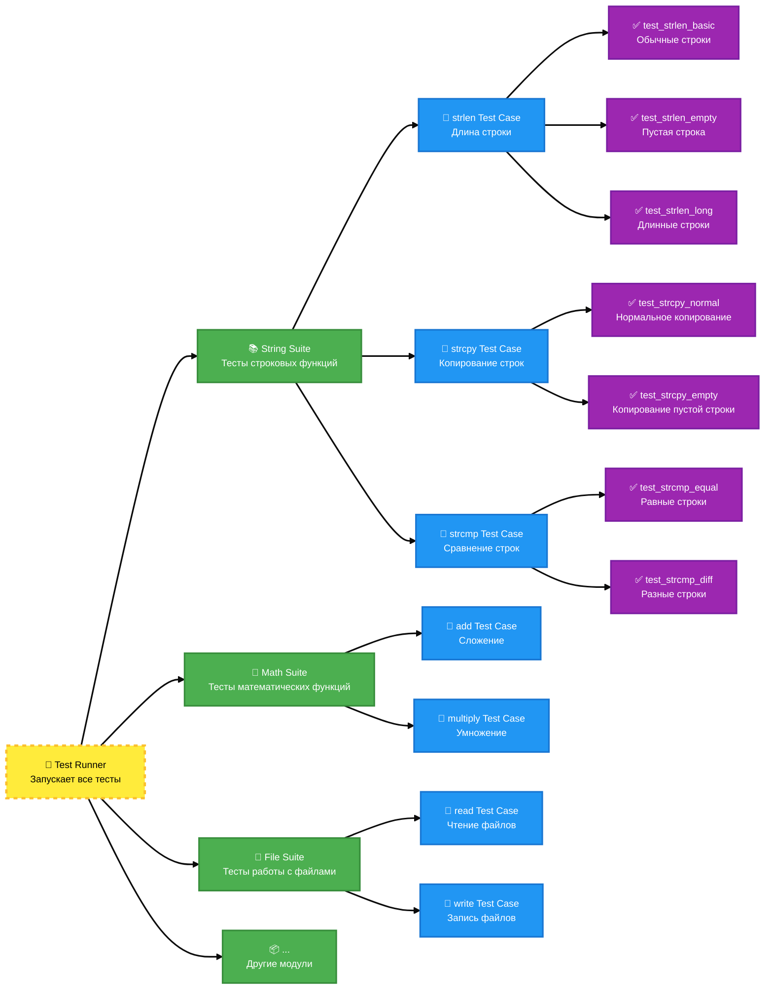
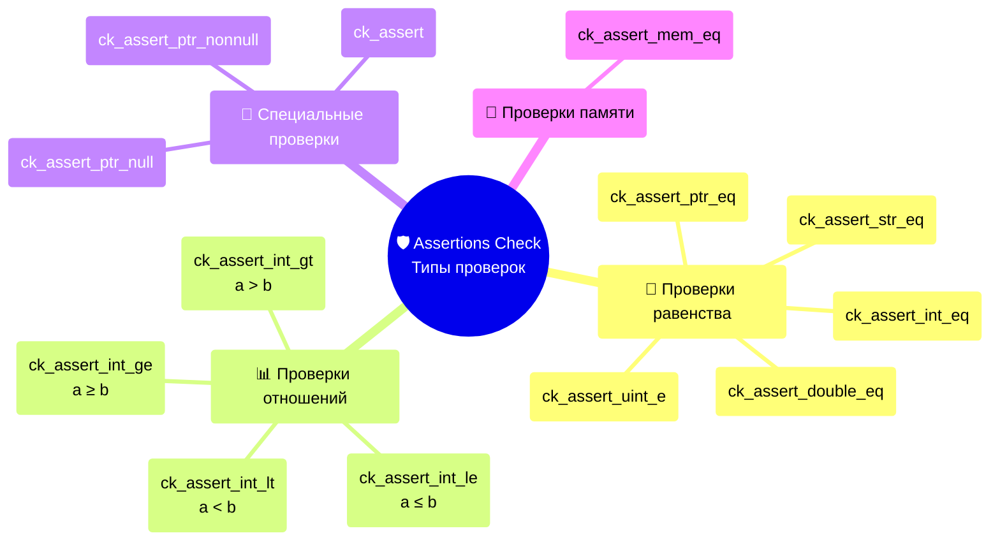
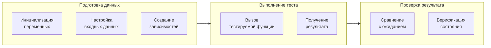

# Модульное тестирование (Unit testing)

**Модульный тест** - это программа, которая проверяет работу маленькой части кода (функции) в изоляции от остальной программы.

## Библиотека Check

Ссылка на официальный туториал: https://libcheck.github.io/check/doc/check_html/check_3.html

**Check** - библиотека модульного тестирования для программ, написанных на языке С. Она предлагает простой интерфейс для определения модульных тестов, не затрудняя разработчика. Тесты выполняются в отдельном адресном пространстве (запуск тестов в отдельных процессах (через системный вызов `fork()` в ОС Linux), что позволяет отслеживать как ошибки утверждений, так и ошибки кода, вызывающие ошибки сегментации или другие сигналы.

### Основные концепции



#### 1. TTest

**TTest (Тест)** - минимальная единица модульного тестирования, которая находится в самом низу иерархии объектов. Она реализует одну конкретную проверку одной заданной функции. 

Базовый синтаксис модульного теста выглядит следующим образом:
```c
START_TEST(test_name) {
  /* unit test code */
}
END_TEST
```

Пара `START_TEST/END_TEST` — это макросы, которые настраивают базовые структуры для тестирования. Отсутствие маркера `END_TEST` может привести к возникновению различных странных ошибок при компиляции тестов.

Макросы автоматически создадут объект типа `TTest`, к которому можно будет обратиться по имени `test_name`:
```c
typedef struct TTest TTest;
```

Проверки осуществляются с помощью макросов проверок (assertions), которые предоставляет сама библиотека. **Assertion (проверка)** - это утверждение вида "я ожидаю, что данное условие истинно", в противном случае (когда условие ложно) тест падает.

Проверки (assertions) могут быть разбиты на несколько подгрупп, согласно типу проверяемого условия:


##### Базовая проверка - выражение должно быть истинно.

```c
ck_assert(ptr != NULL); // Произвольное условие
```

##### Проверка равенства

```c
ck_assert_int_eq(actual, expected);  // Целые числа
ck_assert_uint_eq(actual, expected); // Беззнаковые целые
ck_assert_str_eq(actual, expected);  // Строки (сравнение содержимого)
ck_assert_ptr_eq(actual, expected);  // Указатели (одинаковые адреса)
```

##### Проверка неравенства

```c
ck_assert_int_lt(a, b);    // a < b  
ck_assert_int_le(a, b);    // a <= b 
ck_assert_int_gt(a, b);    // a > b  
ck_assert_int_ge(a, b);    // a >= b 
```

##### Специальные проверки

```c
ck_assert_ptr_null(ptr);    // Указатель должен быть NULL
ck_assert_ptr_nonnull(ptr); // Указатель не должен быть NULL
```

##### Пример использования

Рассмотрим на примере реализации функции, которая вычисляет длину строки `str`, не включая завершающий нулевой символ:
```c
size_t my_strlen(const char *str);
```

Тестирование функции состоит из трех основных этапов (ААА) - подготовки данных (Arrange), выполнение тестируемой функции (Act), проверка результата (Assert, о которых говорилось выше).



```c
START_TEST(test_strlen_empty) {
	char const *empty_string = "";           // Arrange - подготовка данных
	size_t lenght = my_strlen(empty_string); // Act - вызов функции
	ck_assert_uint_eq(length, 0);            // Assert - проверка результата
}
END_TEST
```

Один тест может содержать как одну, так и несколько проверок (assertions).  Несколько проверок стоит объединять в один тест в тех случаях, когда тестируется одна логическая ответственность функции, либо разные аспекты (соответствующие разным функциям) можно логически объединить. Главное помнить, что при падении одной проверки (assertion) упадет весь тест с оставшимися проверками.

В нашем случае можно написать несколько проверок в одном тесте:
```c
START_TEST(test_strlen_normal_string){
    ck_assert_int_eq(my_strlen("hello"), 5);
    ck_assert_int_eq(my_strlen("hello, world!"), 13);
    ck_assert_int_eq(my_strlen("a"), 1);
}
END_TEST
```

#### 2. TCase

**Test case (Тестовый случай)** - группа связанных тестов. Это контейнер из нескольких тестов, которые проверяют одну функцию ил одну концепцию. 

| Тип / Функция                                    | Назначение                                                     |
| ------------------------------------------------ | -------------------------------------------------------------- |
| `TCase`                                          | Тип декларирующий тестовый случай                              |
| `TCase *tcase_create(char const *tcase_name);`   | Функция для создания тестового случая с именем `tcase_name`    |
| `void tcase_add_test(TCase *tcase, TTest ttest)` | Функция для добавления теста `ttest` в тестовый случай `tcase` |
Предположим, что мы написали несколько тестов для функции `strlen`, которые тестировали разные аспекты ее поведения. Создадим для них общий тестовый случай:
```c
// Создаем Test case для нашего test_strlen
TCase *tc_strlen = tcase_create("strlen_test");

// Добавляем несколько тестов в этот Test case
tcase_add_test(tc_strlen, test_strlen_empty_string);
tcase_add_test(tc_strlen, test_strlen_normal_string);
tcase_add_test(tc_strlen, test_strlen_special_characters);
```

#### 3.  Suite

**Suite (набор тестов)** -  контейнер верхнего уровня, который объединяет все test cases вашего проекта. Способы создания и обработки аналогичны предыдущему пункту:

| Тип / Функция                                      | Назначение                                                               |
| -------------------------------------------------- | ------------------------------------------------------------------------ |
| `Suite`                                            | Тип декларирующий набор тестов                                           |
| `Suite *suite_create(char const *suite_name);`     | Функция для создания набора тестов с именем `suite_name`                 |
| `void suite_add_tcase(Suite *suite, TCase *tcase)` | Функция для добавления тестового случая `tcase` в тестовый набор `suite` |
Пусть мы создали тесты и соответственно тестовые случаи для двух других строковых функций - `strcpy` и `strcmp`. Объединим их в один тестовый набор:
```c
// Создание suite
Suite *string_suite = suite_create("String Library Tests");

// Добавляем различные test cases в suite
suite_add_tcase(string_suite, tc_strlen);
suite_add_tcase(string_suite, tc_strcpy);
suite_add_tcase(string_suite, tc_strcmp);
```

Хорошей практикой является использование отдельной функции для создания тестового набора **Suite** (и, возможно, отдельной функции для создания тестового случая **TCase**). Это позволяет изолировать давление новых модульных тестов и тестовых случаев внутри такой функции, не меняя при этом дальнейшую логику запуска тестов. Вторая причина заключается в том, что модульные тесты определяются как статические функции (после отработки макроса `START_TEST`). Это означает, что код для добавления модульных тестов в тестовые случаи должен находиться в том же модуле компиляции, что и сами модульные тесты. Таким образом, файл, содержащий  тестовый набор для рассматриваемых нами функций может выглядеть следующим образом:
```c
///< test.h

#ifndef TEST_H
#define TEST_H

#include <check.h>
#include "../my_string.h"

Suite *test_common_functions(void);

#endif
```

```c
///< test_common_func.c

#include "test.h"

// Модульные тесты для функции my_strlne()
START_TEST(test_strlen_empty_string) {
	/*...*/
} 
END_TEST

START_TEST(test_strlen_normal_string) {
	/*...*/
} 
END_TEST

START_TEST(test_strlen_special_characters) {
	/*...*/
} 
END_TEST

// Модульные тесты для функции my_strcpy()
START_TEST(test_strcpy_all) {
	/*...*/
} 
END_TEST

// Модульные тесты для функции my_strcmp()
START_TEST(test_strcmp_all) {
	/*...*/
} 
END_TEST

// Создание тестового набора выделяем в отдельную функцию
Suite *test_common_functions(void) {
	TCase *tc_strlen = tcase_create("strlen_test");
	tcase_add_test(tc_strlen, test_strlen_empty_string);
	tcase_add_test(tc_strlen, test_strlen_normal_string);
	tcase_add_test(tc_strlen, test_strlen_special_characters);
	
	TCase *tc_strcpy = tcase_create("strcpy_test");
	tcase_add_test(tc_strcpy, test_strcpy_all);
	
	TCase *tc_strcmp = tcase_create("strcmp_test");
	tcase_add_test(tc_strcmp, test_strcmp_all);
	
	Suite *suite_common = suite_create("CommonStringSuite");
	suite_add_tcase(suite_common, tc_strlen);
	suite_add_tcase(suite_common, tc_strcpy);
	suite_add_tcase(suite_common, tc_strcmp);
	
	return suite_common;
}
```

*Примечания:*
- В нашем случае можно было поступить проще: создать по одному модульному тесту на каждую функцию и объединить их в один тестовый случай. Это разгрузит код, но уменьшит степень тестирования.
- Использование `void` в качестве аргумента функции указывает на то, что функция строго не имеет параметров. Пустые скобки не обеспечивают полный прототип функции (согласно документации GCC)
	```c
	///< until C23
	int f(void); // declaration: takes no parameters
	int g();     // declaration: takes unknown parameters
	```
#### 4. SRunner

Для запуска модульных тестов с помощью **Check** необходимо создать несколько **TCase** (тестовых случаев), объединить их в **Suite** (тестовый набор) и запустить с помощью **SRunner** (инструмента для запуска тестовых наборов).  Это самый верхний элемент иерархии объектов в библиотеке **Check**.

```c
┌─────────────────┐
│   Test Runner   │  ← SRunner, srunner_create(suite), 
└─────────────────┘             srunner_run_all()
         │
         ├──────────────────┐
         │                  │
┌─────────────┐      ┌─────────────┐
│  Test Suite │      │  Test Suite │  ← Suite, suite_create(name)
└─────────────┘      └─────────────┘           sute_add_tcase(suite, tcase)
         │                  │
         ├─────────┐        ├─────────┐
         │         │        │         │
    ┌─────────┐ ┌─────────┐    ┌─────────┐
    │ Test    │ │ Test    │    │ Test    │  ← TCase, tcase_create(name)
    │ Case    │ │ Case    │    │ Case    │           tcase_add_test(tcase, UTest)
    └─────────┘ └─────────┘    └─────────┘
         │         │                │
         ├───┐     ├───┬───┐        ├───┐
         │   │     │   │   │        │   │
     ┌─────┐ ┌─────┐ ┌─────┐    ┌─────┐ ┌─────┐
     │Test │ │Test │ │Test │    │Test │ │Test │  ← TTest, START_TEST/END_TEST
     └─────┘ └─────┘ └─────┘    └─────┘ └─────┘
```

Такой алгоритм действий может казаться перегруженным, однако требует лишь разовой настройки всей последовательности действий. Далее можно просто добавлять модульные тесты в уже готовые тестовые случаи.

##### Создание

Создать объект типа **Srunner** можно с помощью функции:
```c
SRunner *srunner_create(Suite *suite); // suite может быть NULL
```

Добавить дополнительный **Suite** можно следующей функцией:
```c
void srunner_add_suite(SRunner *runner, Suite *suite);
```

##### Запуск

Функции для запуска тестов с помощью **SRunner** определены следующим образом:
```c
void srunner_run_all(SRunner *sr, enum print_output print_mode);
```

```c
void srunner_run(SRunner *sr, char const *sname, char const *tcname,
                 enum print_output print_mode);****
```

Данные функции выполняют две задачи:

- Запускают все модульные тесты для выбранных тестовых случаев, определённых для выбранных наборов в **SRunner**, и собирают результаты в **SRunner**. Определение выбранных тестовых случаев (**TCase**) и наборов (**Suite**) зависит от конкретной используемой функции.

	`srunner_run_all` запускает все определённые тестовые случаи всех определённых наборов, за исключением случаев, когда определены переменные окружения `CK_RUN_CASE` или `CK_RUN_SUITE`. Если они определены, эти переменные должны содержать имя тестового набора или тестового случая, определяя таким образом выбранный набор/тестовый случай.

	`srunner_run` запускает **Suite**/**TCase**, выбранный параметрами `sname` и `tcname`. Значение NULL в некоторых из этих параметров означает «любой **Suite**/**TCase**»

- Они выводят результаты в соответствии с заданным параметром `print_mode`:
	```c
	enum print_output {
    CK_SILENT,    // Минимальный вывод
    CK_MINIMAL,   // Только итоги
    CK_NORMAL,    // Стандартный вывод (рекомендуется)
    CK_VERBOSE,   // Подробный вывод
    CK_ENV,       // Из переменной окружения CK_VERBOSITY
    CK_SUBUNIT    // Выводит информацию о ходе выполнения протокола выполнения                         // субъединичного теста (см док.)
    };
	```

##### Проверка результата

Результат тестирования можно получить с помощью функции `srunner_ntests_failed`, которая возвращает количество неудачных тестов:
```c
int srunner_ntests_failed(SRunner *runner);
```

##### Освобождение памяти

После завершения тестирования необходимо освободить все ресурсы связанные с **SRunner**. Для этого используется функция:
```c
void srunner_free(SRunner *runner);
```

##### Итоговый пример

Согласно описанным выше примерам создание и работа с тестами будут выглядеть следующим образом:
```c
///< test.c

#include "test.h"
#include <stdlib.h>

int main(void) {
	Suite *common_suite = test_common_functions();
	SRunner *runner = srunner_create(common_suite);
	
	srunner_run_all(runner, CK_NORMAL);
	
	int failed_count = srunner_ntests_failed(runner);
	
	srunner_free(runner);
	
	return failed_count ? EXIT_FAILURE : EXIT_SUCCESS;
}
```

### Структура проекта

Следуя рассматриваемому выше примеру структура проекта на языке С будет иметь следующую структуру:
```bash
my_string_project/         # Репозиторий с исходным кодом
├── src/                   # Модуль, реализующий библиотеку string
│   ├── my_string.c            # Реализации функций
│   └── my_string.h            # Заголовочный файл
├── tests/                 # Модуль тестирования
│   ├── test_common_func.c     # Юнит тесты, TCase и функция создания Suite
|   ├── test.c                 # Запуск тестирования и проверка результатов
|   ├── test.h                 # Сигнатуры функций для создания Suite
│   └── Makefile               # Makefile для сборки тестов
└── Makefile               # Makefile основного проекта
```

